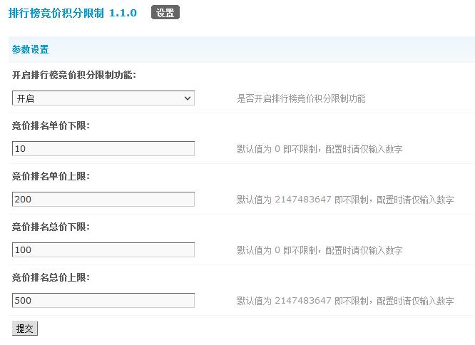

# 排行榜竞价积分限制

## 应用介绍

**您还在纠结排行榜竞价排名模块内大量低积分用户占据排行榜黄金位置么？还在担心论坛积分无法快速消耗么？还在担心用户一掷千金不符合社会导向么？**

本插件特别为此设计，可以限制排行榜竞价排名功能中竞价单价的上下限以及竞价金钱的上下限，**引导用户按要求进行竞价排名，优化积分运作体系，完善站点积分策略。**

## 开源信息

本插件使用 Apache 2.0 License 发布，并已经登录 GitHub 平台，地址为: https://github.com/laozhoubuluo/discuz_ranklistlimit 。

如有任何问题，欢迎您通过 Issue 反馈，或通过 Pull Requests 进行改进。

也欢迎您通过 Star 鼓励我们继续开发类似产品。

## 图片展示

